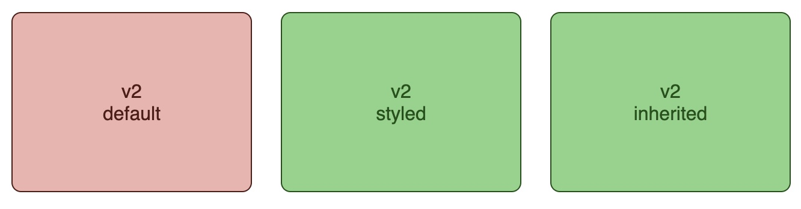
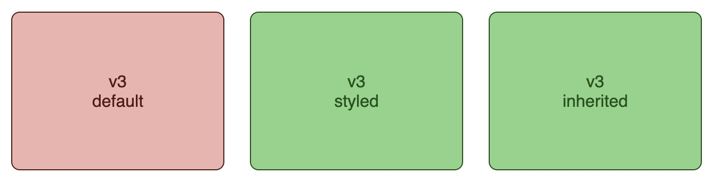

# Styling web component


Recently, while working on a full web application built as a hierarchy of web
components, I found out more about how custom CSS properties are defined and
inherited, and discovered a useful trick to apply consistent styling across the
entire application.

## Common approach

When defining a web component with stylable CSS properties, the standard
approach is to define custom properties on the `:host` selector with default
values, and use them to style the component.

```css
:host {
    --custom-color: hsl(5, 60%, 20%);
    --custom-surface: hsl(5, 69%, 81%);
}
```

Outside of the component, the custom properties can be redefined on the custom
element to apply the overall document styling.

```css
my-component {
    --custom-color: hsl(120, 60%, 20%);
    --custom-surface: hsl(120, 47%, 68%);
}
```

However, if the properties are inherited rather than defined explicitly on the
element, then the defaults defined in the component take precedence, and the
inherited properties are ignored.


## A better approach?

Instead of actually defining the custom properties at the root of the component,
you could just access the variables where needed, and systematically provide a
default value for every reference:

```css
div {
    color: var(--custom-color, hsl(5, 60%, 20%));
    background-color: var(--custom-surface, hsl(5, 69%, 81%));
    border: 1px solid var(--custom-color, hsl(5, 60%, 20%));
}
```




The downside of this approach is that the default values must be duplicated
everywhere the property is referenced, and they must all be consistent.

## Threading the needle

A better approach is to define a private version of the custom  property
at the `:host` level of the component, using the public property value if
defined and a default value otherwise. The public property can then be redefined
on the direct descendants of the `:host` using the private variable as a value.

```css
:host {
    --_custom-color: var(--custom-color, hsl(5, 60%, 20%));
    --_custom-surface: var(--custom-surface, hsl(5, 69%, 81%));
}
:host>* {
    --custom-color: var(--_custom-color);
    --custom-surface: var(--_custom-surface);
}
```

Internally, all references can use the public property, and nested components
will inherit the inherited value if any or the component default value
otherwise.



## Benefits

- The web components take custom properties, either explicit or inherited, with
  a component defined default value if not specified externally.
- All the custom properties of a web component, and their default values, are
  neatly defined in a single place, in the `:host` of the component.
- Application level styling properties can be grouped in the `:root` of the
  main document CSS.
